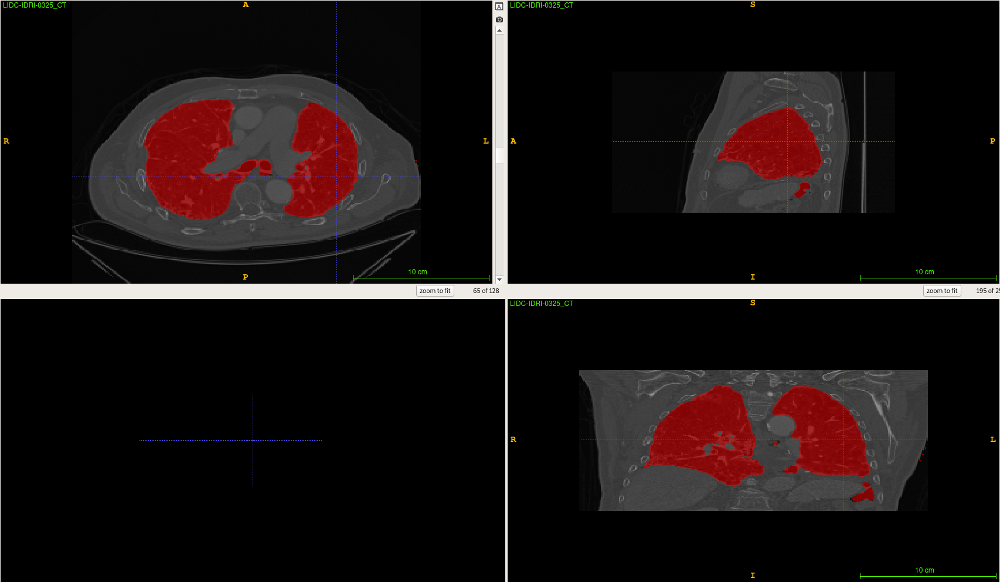

# Lung Segmentation

Lung Segmentation using a U-Net model on 3D CT scans.

## Current results example :



## Getting started

### Installation

Our base wmlce conda environment does not come with `SimpleITK` nor `pynrrd`, two required python libraries to run this code.

+ To install `pynrrd`:
```
$ pip install pynrrd
```

+ To install `SimpleITK` (from `.whl`):
```
$ pip install SimpleITK-1.2.0+gd6026-cp36-cp36m-linux_ppc64le.whl
```
  + If you do not have access to the whl file, you need to build it (on power pc)

### Tree

```
.
+-- data/
    +-- dataset.py	: Class describing the dataset we use for lung segmentation
    +-- utils.py	: Script for manipulating medical files
+-- config.json
+-- eval.py
+-- model.py		: U-Net model definition
+-- predict.py		: Inference script to run infer lung mask on a CT-scan
+-- README.md		: This documentation file
+-- train.py		: Train script to train a new lung segmentation model
```

### Data 

The data used is the __TCIA LIDC-IDRI__ dataset Standardized representation ([download here](https://wiki.cancerimagingarchive.net/display/DOI/Standardized+representation+of+the+TCIA+LIDC-IDRI+annotations+using+DICOM)), combined with matching lung masks from __LUNA16__ (not all CT-scans have their lung masks in LUNA16 so we need the list of segmented ones).

3 parameters have to be fulfilled to use available data:
+ `labelled-list`: path to the `pickle` file containing the list of CT-scans from the TCIA LIDC-IDRI dataset for which we have access to the lung segmentation masks through the LUNA16 dataset.
+ `scans`: path to the TCIA LIDC-IDRI dataset.
+ `masks`: path to the LUNA16 dataset containing lung masks.

You can manipulate data trough the `data/dataset.py` (class describing our lung segmentation dataset) and `data/utils.py` (tools for manipulating medical files) files.

### Predictions

To perform predictions on unseen CT-scans, run for example (wmlce on powerai):
```
$ data=/wmlce/data/medical-datasets/LIDC-IDRI/LIDC-IDRI-0325/1.3.6.1.4.1.14519.5.2.1.6279.6001.815399168774050638734383723372/1.3.6.1.4.1.14519.5.2.1.6279.6001.725023183844147505748475581290/LIDC-IDRI-0325_CT.nrrd
$ output_path=/wmlce/data/projects/lung_segmentation/output/preds
$ nb_classes=1
$ start_filters=32
$ model=/wmlce/data/projects/lung_segmentation/model
$ python3 predict.py -d $data -o $output_path -m $model -c $nb_classes -f $start_filters -t [-e]
```
+ See `python3 predict.py --help` for more information.

### Evaluation 

To perform evaluation using the existing model, run for example (wmlce on powerai):
```
$ LABELLED_LIST=/wmlce/data/retina-unet/data/labelled.pickle
$ MASKS=/wmlce/data/retina-unet/data/lung_masks_LUNA16
$ SCANS=/wmlce/data/retina-unet/data/LIDC-IDRI
$ NB_CLASSES=1
$ START_FILTERS=32
$ python3 eval.py --labelled-list $LABELLED_LIST --masks $MASKS --scans $SCANS --nb-classes $NB_CLASSES --start-filters $START_FILTERS 
``` 
+ See `python3 eval.py --help` for more information.

### Training

To run training:
```
python train.py -d output/preprocessing/
```
+ See `python train.py --help` for more information
